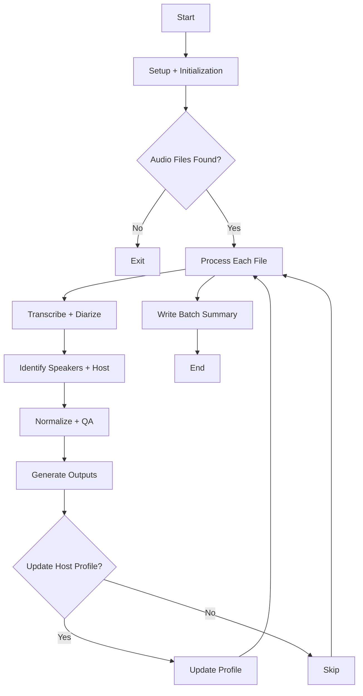

# Podcast Host Transcription Pipeline

This project batch-processes podcast audio files into speaker-labeled transcripts, host-only extracts, JSON metadata, and review CSVs. Its larger purpose is to generate structured, reviewable source material for downstream insertion into a RAG pipeline and vector database. It combines speech-to-text, speaker diarization, speaker-embedding matching, and terminology normalization so episodes can be transcribed in a way that is more useful for editorial review and retrieval-oriented content workflows.


## 🧠 System Overview



The repository is designed for shows where identifying the host matters. In addition to generic speaker diarization, it can:

- label the host from a one-time reference clip
- maintain a persistent host voice profile across episodes
- identify recurring named speakers from a reference-sample directory
- create a host-only transcript for faster review
- flag episodes and transcript segments that likely need manual verification

## What The Project Does

For each supported audio file in an input folder, the pipeline:

1. Transcribes the episode with `faster-whisper`
2. Runs speaker diarization with `pyannote.audio`
3. Builds speaker embeddings with `speechbrain`
4. Tries to identify the host from:
   - a selected host reference clip
   - a saved `host_profile.json`
   - a known speaker marked as the host
   - or, optionally, the dominant speaker as a bootstrap fallback
5. Renames diarized speakers to `HOST`, known names, or `SPEAKER_01`, `SPEAKER_02`, and so on
6. Applies preferred-term biasing and post-transcription replacement cleanup
7. Writes transcript, JSON, and review outputs back to disk

## Repository Contents

- `podcast_transcribe_host.py`: main Python pipeline
- `Convert MP3 to TXT diarized.ps1`: Windows PowerShell launcher that auto-loads `.env`, validates the Hugging Face token early, and uses persisted config values before prompting
- `podcast_transcribe_config.example.json`: example runtime configuration file
- `podcast_transcribe_requirements.txt`: Python package list
- `preferred_terms.txt`: optional glossary for domain-specific spellings
- `preferred_replacements.json`: optional post-processing replacements for common mistranscriptions
- `speaker_reference_samples/speakers.json`: sample configuration for recurring known speakers
- `podcast_transcribe_README.md`: legacy project notes and feature details

## Technical Details

The pipeline is centered around three model-driven stages:

- Transcription: `faster-whisper` performs speech-to-text with word timestamps enabled.
- Diarization: `pyannote/speaker-diarization-community-1` assigns speaker turns across the episode.
- Speaker matching: `speechbrain/spkrec-ecapa-voxceleb` generates embeddings used to match diarized speakers against the host profile or known speaker references.

Important implementation details:

- Audio is normalized to mono 16 kHz before speaker embedding extraction.
- Diarization audio is preloaded in memory before being passed to `pyannote.audio`, which avoids depending on `torchcodec` for file decoding during diarization.
- Host matching uses cosine similarity against a host reference embedding or saved host profile.
- Known speakers are matched one-to-one against diarized speakers when similarity clears the configured threshold.
- The host profile can be updated over time from matched host speech to improve stability across episodes.
- A review-priority score is generated per episode so the riskiest outputs can be checked first.
- The console now shows batch progress, per-file transcription progress, and diarization progress so long runs are easier to monitor.

Supported audio formats:

- `.mp3`
- `.wav`
- `.m4a`
- `.flac`
- `.ogg`

Generated outputs per audio file:

- `*_speaker_transcript.txt`
- `*_host_only.txt`
- `*_review.csv`
- `*_speaker_transcript.json`

Generated output per batch:

- `_episode_review_summary.csv`

## Requirements

This project currently assumes a Windows workflow because the included launcher is a PowerShell script that opens Windows folder and file dialogs.

You will need:

- Python installed and available on `PATH`
- Conda if you want to use the launcher exactly as written
- A Hugging Face account and access token
- Access approval for `pyannote/speaker-diarization-community-1` on Hugging Face
- A Windows FFmpeg build with shared DLLs available, such as `C:\ffmpeg\bin`
- Enough local compute for Whisper, pyannote, and PyTorch-based audio processing

Python dependencies:

- `faster-whisper`
- `pyannote.audio`
- `speechbrain`
- `torchaudio`

## First-Time Setup

### 1. Clone the repository

```powershell
git clone https://github.com/Alex870/podcast-host-transcription-pipeline.git
cd podcast-host-transcription-pipeline
```

### 2. Create a Python environment

The PowerShell launcher currently runs `conda activate podcast-transcribe`, so the path of least resistance is to create an environment with that name.

Example:

```powershell
conda create -n podcast-transcribe python=3.11 -y
conda activate podcast-transcribe
pip install -r podcast_transcribe_requirements.txt
```

If you prefer a different environment name or a plain virtual environment, that is fine, but you will need to update `Convert MP3 to TXT diarized.ps1` so it does not assume `conda activate podcast-transcribe`.

### 3. Get a Hugging Face token

The diarization pipeline will not run without a valid Hugging Face token.

First:

- Sign in to Hugging Face
- Request and accept access to `pyannote/speaker-diarization-community-1`
- Create an access token

Then provide the token in one of these ways:

- Set `HF_TOKEN` in your shell environment
- or place `HF_TOKEN` in a local `.env` file beside the scripts
- or place it in `podcast_transcribe_config.json`

Example for the current shell:

```powershell
$env:HF_TOKEN = "your_token_here"
```

### 4. Create your runtime config file

Copy the example file to a working config:

```powershell
Copy-Item .\podcast_transcribe_config.example.json .\podcast_transcribe_config.json
```

Recommended first-pass config:

```json
{
  "default_source_dir": "D:/Speech_to_text/audio",
  "hf_token": "",
  "ffmpeg_bin_dir": "C:/ffmpeg/bin",
  "known_speakers_dir": "speaker_reference_samples",
  "preferred_terms_file": "preferred_terms.txt",
  "replacement_map_json": "preferred_replacements.json",
  "host_profile_json": "host_profile.json",
  "model": "large-v3",
  "language": "en",
  "device": "auto",
  "compute_type": "auto",
  "beam_size": 5,
  "batch_size": 8,
  "assume_dominant_speaker_is_host": true,
  "host_threshold": 0.45
}
```

Configuration notes:

- `default_source_dir`: starting folder shown in the launcher dialog
- `hf_token`: optional fallback if `HF_TOKEN` is not already set in the environment
- `ffmpeg_bin_dir`: directory containing the FFmpeg DLLs used by the Windows runtime
- `known_speakers_dir`: folder containing `speakers.json` and reference clips
- `preferred_terms_file`: glossary terms to bias transcription
- `replacement_map_json`: preferred replacements for cleanup after transcription
- `host_profile_json`: persistent host voice profile created over time
- `model`: Whisper model name
- `language`: language code passed to Whisper
- `device`: Whisper runtime device such as `auto`, `cpu`, or `cuda`
- `compute_type`: Whisper compute setting such as `auto`, `float16`, or `int8`
- `beam_size`: decode beam size
- `batch_size`: transcription batch size
- `assume_dominant_speaker_is_host`: fallback host bootstrap if no better match exists
- `host_threshold`: speaker similarity threshold for host and known-speaker matching

### 5. Optional: set up known speaker samples

If you want stable speaker naming across episodes, add clean reference clips to `speaker_reference_samples` and edit `speaker_reference_samples/speakers.json`.

Example:

```json
{
  "speakers": [
    {
      "name": "HOST",
      "is_host": true,
      "files": ["host_sample.wav"]
    },
    {
      "name": "Guest_A",
      "files": ["guest_a_sample.wav"]
    }
  ]
}
```

Best practices:

- use short, clean clips with only one speaker
- avoid overlap, music beds, and heavy background noise
- provide more than one clip per recurring speaker when possible

## Running The Project

### Option 1: Use the PowerShell launcher

This is the easiest way to run the project on Windows.

```powershell
conda activate podcast-transcribe
.\Convert MP3 to TXT diarized.ps1
```

The launcher will:

- auto-load `HF_TOKEN` from the process environment, `.env`, or `podcast_transcribe_config.json`
- validate the Hugging Face token near startup and print exactly where it tried to read it from
- use `default_source_dir` from `podcast_transcribe_config.json` without prompting when it is already valid
- use `ffmpeg_bin_dir` from config, or prompt for it when missing, and only save it after import checks succeed
- use `known_speakers_dir` from config, or auto-discover the local `speaker_reference_samples` folder, before prompting
- only open a folder picker when required information is missing
- immediately write prompted values back into `podcast_transcribe_config.json`
- write all generated outputs to an `output` folder beside the selected source folder
- show batch progress, transcription progress, and diarization progress in the console
- pass the effective settings into `podcast_transcribe_host.py`

### Option 2: Run the Python script directly

Example:

```powershell
python .\podcast_transcribe_host.py `
  --input-dir "D:\Speech_to_text\audio" `
  --output-dir "D:\Speech_to_text\output" `
  --model large-v3 `
  --language en `
  --device auto `
  --compute-type auto `
  --beam-size 5 `
  --batch-size 8 `
  --preferred-terms-file .\preferred_terms.txt `
  --replacement-map-json .\preferred_replacements.json `
  --host-profile-json .\host_profile.json `
  --known-speakers-dir .\speaker_reference_samples `
  --assume-dominant-speaker-is-host `
  --host-threshold 0.45 `
  --hf-token $env:HF_TOKEN
```

## Basic Workflow

For the best initial results:

1. Put one or more episodes in a source folder
2. Create `podcast_transcribe_config.json`
3. Set a valid Hugging Face token in the environment, `.env`, or config
4. Configure `ffmpeg_bin_dir`
5. Configure `speaker_reference_samples` or point `known_speakers_dir` at an existing sample folder
6. Run the launcher
7. Review outputs in the sibling `output` folder:
   `*_speaker_transcript.txt`, `*_host_only.txt`, `*_review.csv`, `*_speaker_transcript.json`, `_episode_review_summary.csv`

## Troubleshooting

Common first-run issues:

- Missing Hugging Face token:
  The pipeline will stop before diarization if no token is available.
- Token access errors:
  You may have a valid token but still need to accept access terms for `pyannote/speaker-diarization-community-1`.
- `.env` was not picked up:
  The loader now prints every token lookup location it checked, including the exact `.env` and config paths.
- Launcher environment mismatch:
  If `conda activate podcast-transcribe` fails, either create that environment name or update the launcher script.
- No audio files found:
  The selected input folder must contain supported audio formats directly inside it.
- Weak host labeling:
  Provide a cleaner host sample, use named reference clips, and keep `host_profile.json` between runs.
- FFmpeg / TorchCodec warnings on Windows:
  The pipeline preloads diarization audio in memory and can continue working even when TorchCodec cannot decode files directly, but you should still point `ffmpeg_bin_dir` at a valid shared FFmpeg install.
- CPU is used instead of GPU:
  Confirm the environment has CUDA-enabled PyTorch wheels installed and that `torch.cuda.is_available()` returns `True`.

## Notes

- `host_profile.json` is generated during use and should usually be kept if you want host matching to improve over time.
- The review CSVs are intentionally conservative and may flag segments that are acceptable in practice.
- The repository currently focuses on local batch processing rather than a packaged application or service deployment.
