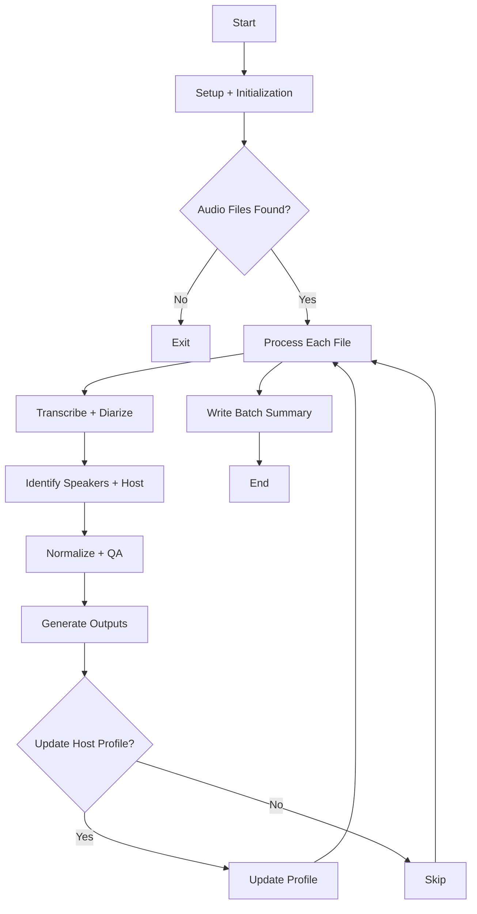

# Podcast Host Transcription Pipeline

This project batch-processes podcast audio files into speaker-labeled transcripts, host-only extracts, JSON metadata, and review CSVs. Its larger purpose is to generate structured, reviewable source material for downstream insertion into a RAG pipeline and vector database. It combines speech-to-text, speaker diarization, speaker-embedding matching, and terminology normalization so episodes can be transcribed in a way that is more useful for editorial review and retrieval-oriented content workflows.

The pipeline is designed for shows where identifying the host matters. In addition to generic speaker diarization, it can:

- label the host from a one-time reference clip
- maintain a persistent host voice profile across episodes
- identify recurring named speakers from a reference-sample directory
- create a host-only transcript for faster review
- flag episodes and transcript segments that likely need manual verification

The shared transcript, processed-cache, Chroma metadata, and `podcast.json` expectations across the podcast toolchain are documented in [`docs/podcast_pipeline_contract.md`](docs/podcast_pipeline_contract.md).

## What The Project Does

For each supported audio file in an input folder, the pipeline:

1. Transcribes the episode with `faster-whisper`
2. Runs speaker diarization with `pyannote.audio`
3. Builds speaker embeddings with `speechbrain`
4. Tries to identify the host from:
   - a selected host reference clip
   - a saved `host_profile.json`
   - a known speaker marked as the host
   - or, optionally, the dominant speaker as a bootstrap fallback
5. Renames diarized speakers to known names, or `HOST`, `SPEAKER_01`, `SPEAKER_02`, and so on
6. Applies preferred-term biasing and post-transcription replacement cleanup
7. Writes transcript, JSON, and review outputs back to disk

## Repository Contents

- `src/podcast_transcribe/`: importable Python package for the transcription framework
- `podcast_transcribe_host.py`: thin compatibility wrapper for `python podcast_transcribe_host.py`
- `Run Podcast Transcribe.ps1`: root bootstrap launcher for environment validation, the main processing pipeline, and legacy-state migration
- `scripts/Convert-AudioToDiarizedText.ps1`: Windows PowerShell launcher that auto-loads `.env`, validates the Hugging Face token early, and uses persisted config values before prompting
- `scripts/Debug-PodcastTranscribeEnvironment.ps1`: focused environment and dependency diagnostic script
- `scripts/Migrate-LegacyPodcastTranscribeState.ps1`: migrates runtime config, glossary files, speaker-reference material, processed-state files, and output artifacts from a legacy working directory
- `examples/podcast_transcribe_config.example.json`: example runtime configuration file
- `examples/preferred_terms.txt`: optional glossary for domain-specific spellings
- `examples/preferred_replacements.json`: optional post-processing replacements for common mistranscriptions
- `docs/`: architecture, roadmap, and cross-pipeline contract notes
- `podcast_transcribe_requirements.txt`: Python package list
- `speaker_reference_samples/speakers.json`: sample configuration for recurring known speakers

## Launchers

For normal use, start with the root bootstrap:

```powershell
.\Run Podcast Transcribe.ps1
```

It gives you a simple choice:

1. Run environment validation
2. Run the transcription pipeline
3. Migrate settings and state from a legacy directory

## Technical Details

The pipeline is centered around three model-driven stages:

- Transcription: `faster-whisper` performs speech-to-text with word timestamps enabled.
- Diarization: `pyannote/speaker-diarization-community-1` assigns speaker turns across the episode.
- Speaker matching: `speechbrain/spkrec-ecapa-voxceleb` generates embeddings used to match diarized speakers against the host profile or known speaker references.

Key implementation details:

- Audio is normalized to mono 16 kHz before speaker embedding extraction.
- Batch runs default to isolated per-file child processes so native allocations from Whisper, pyannote, SpeechBrain, NumPy, and PyTorch are released by the OS between episodes.
- Diarization audio is preloaded in memory before being passed to `pyannote.audio` when pyannote's path decoder is unavailable, which avoids depending on `torchcodec` for file decoding during diarization.
- Host matching uses cosine similarity against a host reference embedding or saved host profile.
- Known speakers are matched one-to-one against diarized speakers when similarity clears the configured threshold.
- The host profile can be updated over time from matched host speech to improve stability across episodes.
- A review-priority score is generated per episode so the riskiest outputs can be checked first.
- The console now shows batch progress, per-file transcription progress, and diarization progress so long runs are easier to monitor.

## Observed Performance

Accuracy has been favored over speed in this pipeline.  Processing time is largely determined by the GPU speed, and will regularly stay at near 100% for most of the operating time.  CPU speed does not appear to be a significant factor.

Measured run:

- Podcast duration processed: `2:34:00`
- Total processing time: `15:26`
- Effective processing rate: about `6` minutes of processing time per hour of podcast audio
- Peak observed VRAM usage: `8082 MiB`, where non-script components (e.g. Windows display usage) accounted for `2460 MiB` of that peak value.

Observed on:

- NVIDIA GeForce RTX 5070 Ti
- NVIDIA driver version `596.21`
- CUDA version `13.2`

This is a practical reference point for estimating batch runs on a similar Windows GPU setup.

Supported audio formats:

- `.mp3`
- `.wav`
- `.m4a`
- `.flac`
- `.ogg`

Generated outputs per audio file:

- `*_speaker_transcript.txt`
- `*_host_only.txt`
- `*_review.csv`
- `*_speaker_identity_review.csv`
- `*_speaker_transcript.json`
- `*_cleaned_speaker_transcript.txt`
- `*_cleaned_host_only.txt`
- `*_cleaned_speaker_transcript.json`
- `*_manifest.json`

The regular transcript files preserve the post-diarization transcript text as produced by Whisper plus configured glossary replacements. The cleaned transcript files are companion outputs for easier reading and downstream retrieval. They apply conservative speech-cleanup rules for obvious repeated words, immediate restarts, and small dead-end fragments while keeping the original transcript available for comparison. Cleaned JSON segments include `original_text` and `cleanup_applied` when a segment was changed.

Cleanup behavior is controlled by `cleanup_level`: `disabled`, `conservative`, `normal`, or `aggressive`. Manual correction CSVs can be supplied through `corrections_dir`; files named `<audio_stem>_corrections.csv` may use `segment_id`/`id`, `corrected_text`/`text`, and `speaker` columns to patch transcript text or speaker labels before cleaned outputs are generated.

JSON outputs include `schema_version`, pipeline metadata, episode date fields, and per-segment `transcription_confidence` derived from Whisper `avg_logprob` and `no_speech_prob`. The per-episode manifest records source fingerprints, config fingerprints, stage timings, output file hashes, and the episode summary row.

The executable transcript contract lives in `src/podcast_transcribe/contract.py`. It defines the current transcript schema version, required top-level fields, required segment fields, and validation rules used before JSON outputs are written. Downstream tools can import the same module or mirror its required fields when validating handoffs.

Each segment also includes deterministic `content_quality` tags for likely sponsor blocks, music/transition text, boilerplate, repetition, and possible silence/non-speech. These tags are intentionally conservative hints for review and downstream filtering; they do not remove content from the transcript.

Known-speaker reference samples are quality-checked for short duration, quiet audio, clipping risk, and silence/non-speech ratio while speaker profiles are loaded. Batch reports include speaker aggregates and recurring unnamed-speaker promotion candidates when enough summary data is available.

The pipeline writes reusable intermediate artifacts under `_processing_artifacts` after transcription and diarization complete. If a later stage fails, the next run can resume inside the episode and avoid repeating completed heavy work. Use `--no-resume-intermediates` to disable this behavior, or `--archive-debug-artifacts` to keep artifacts after a successful episode for debugging. Isolated child workers can be guarded with `--child-timeout-seconds`; timeout failures leave artifacts in place for the next run.

Before model loading, the launcher performs a disk-space preflight and can print a dry benchmark plan with `--benchmark-only`. Batch progress now includes an audio-duration-aware ETA when file durations can be read.

Generated output per batch:

- `_episode_review_summary.csv`
- `_batch_report.md`

Episode dates are extracted from the last valid `YYYYMMDD` token in each source filename, such as `TFM 20260204.mp3`. The pipeline writes that date as structured metadata for RAG ingestion:

- `episode_date`: ISO date, for example `2026-02-04`
- `episode_date_compact`: original compact date, for example `20260204`
- `episode_year`, `episode_month`, `episode_day`
- `episode_sort_key`: numeric `YYYYMMDD` value for chronological sorting and filtering

Filename date parsing is configurable. By default the parser uses the `strict_iso` preset and prefers the last valid match in the filename. Additional presets and explicit ordered format lists can be configured through `filename_date` in `podcast_transcribe_config.json`, so common styles like `YYYY-MM-DD` and `MM-DD-YYYY` can be supported without writing custom regex.

The structured JSON includes these fields at the top level, inside `metadata`, and on each transcript segment so vector-database chunking can preserve time context. The text transcripts include a small metadata header, and `_episode_review_summary.csv` includes the date columns for later trend and viewpoint-evolution summarization.

## Requirements

This project currently assumes a Windows workflow because the included launcher is a PowerShell script that opens Windows folder and file dialogs.

You will need:

- Miniconda, Conda, or another Conda-compatible distribution installed and available on `PATH`
- A Hugging Face account and access token
- Access approval for `pyannote/speaker-diarization-community-1` on Hugging Face
- Access approval for `pyannote/segmentation-3.0` on Hugging Face
- A Windows FFmpeg build with shared DLLs available, such as `C:\ffmpeg\bin`
- Enough local compute for Whisper, pyannote, and PyTorch-based audio processing
- An NVIDIA GPU is recommended if you want practical performance with the current CUDA-oriented setup

Python dependencies:

- `faster-whisper`
- `pyannote.audio`
- `speechbrain`
- `torchaudio`

## First-Time Setup

### 1. Clone the repository

```powershell
git clone https://github.com/Alex870/Podcast-Host-Transcription-Pipeline.git
cd Podcast-Host-Transcription-Pipeline
```

### 2. Create a Python environment

The PowerShell launchers currently run `conda activate podcast-transcribe`, so the path of least resistance is to create an environment with that name.

Example:

```powershell
conda create -n podcast-transcribe python=3.11 -y
conda activate podcast-transcribe
pip install -r podcast_transcribe_requirements.txt
```

If you prefer a different environment name or a plain virtual environment, update the launchers under `scripts\` accordingly, especially `scripts/Convert-AudioToDiarizedText.ps1` and `scripts/Debug-PodcastTranscribeEnvironment.ps1`.

### 3. Get a Hugging Face token

The diarization pipeline will not run without a valid Hugging Face token.

First:

- Sign in to Hugging Face
- Request and accept access to `pyannote/speaker-diarization-community-1`
- Request and accept access to `pyannote/segmentation-3.0`
- Create an access token

Then provide the token in one of these ways:

- Set `HF_TOKEN` in your shell environment
- or place `HF_TOKEN` in a local `.env` file in the project root
- or place it in `podcast_transcribe_config.json`

Example for the current shell:

```powershell
$env:HF_TOKEN = "your_token_here"
```

### 4. Create your runtime config file

Copy the example file to a working config:

```powershell
Copy-Item .\examples\podcast_transcribe_config.example.json .\podcast_transcribe_config.json
```

Recommended first-pass config:

```json
{
  "default_source_dir": "C:/Speech_to_text/audio",
  "hf_token": "",
  "ffmpeg_bin_dir": "C:/ffmpeg/bin",
  "known_speakers_dir": "speaker_reference_samples",
  "preferred_terms_file": "examples/preferred_terms.txt",
  "replacement_map_json": "examples/preferred_replacements.json",
  "filename_date": {
    "preset": "strict_iso",
    "position": "last"
  },
  "host_profile_json": "host_profile.json",
  "model": "large-v3",
  "language": "en",
  "device": "auto",
  "compute_type": "float16",
  "beam_size": 5,
  "batch_size": 8,
  "assume_dominant_speaker_is_host": true,
  "host_threshold": 0.45
}
```

Configuration notes:

- `default_source_dir`: starting folder shown in the launcher dialog
- `hf_token`: optional fallback if `HF_TOKEN` is not already set in the environment
- `ffmpeg_bin_dir`: directory containing the FFmpeg DLLs used by the Windows runtime
- `known_speakers_dir`: folder containing `speakers.json` and reference clips
- `preferred_terms_file`: glossary terms to bias transcription
- `replacement_map_json`: preferred replacements for cleanup after transcription
- `filename_date`: optional filename date parser settings
  - `preset`: built-in parser preset such as `strict_iso`, `american_podcast`, or `mixed_common`
  - `position`: whether to use the `first` or `last` valid date match in the filename
  - `formats`: optional ordered list of explicit formats that overrides the preset
- `host_profile_json`: persistent host voice profile created over time
- `model`: Whisper model name
- `language`: language code passed to Whisper
- `device`: Whisper runtime device such as `auto`, `cpu`, or `cuda`
- `compute_type`: Whisper compute setting such as `float16` or `int8`; the current launcher defaults to `float16`
- `beam_size`: decode beam size
- `batch_size`: transcription batch size
- `assume_dominant_speaker_is_host`: fallback host bootstrap if no better match exists
- `host_threshold`: speaker similarity threshold for host and known-speaker matching

### 5. Optional: set up known speaker samples

If you want stable speaker naming across episodes, add clean reference clips to `speaker_reference_samples` and edit `speaker_reference_samples/speakers.json`.

Example:

```json
{
  "speakers": [
    {
      "name": "HOST",
      "is_host": true,
      "files": ["host_sample.wav"]
    },
    {
      "name": "Guest_A",
      "files": ["guest_a_sample.wav"]
    }
  ]
}
```

Best practices:

- use short, clean clips with only one speaker
- avoid overlap, music beds, and heavy background noise
- provide more than one clip per recurring speaker when possible

### 6. Optional: customize preferred terms and replacements

If the show uses recurring names, jargon, or phrases that Whisper often misspells, set up the glossary and replacement helpers before large transcription runs.

Start from the example files:

```powershell
Copy-Item .\examples\preferred_terms.txt .\preferred_terms.txt
Copy-Item .\examples\preferred_replacements.json .\preferred_replacements.json
```

Then update `podcast_transcribe_config.json` so the pipeline points at your working copies:

```json
{
  "preferred_terms_file": "preferred_terms.txt",
  "replacement_map_json": "preferred_replacements.json"
}
```

If you already have an older working directory with transcripts, speaker samples, or local config, you can migrate it after setup through:

```powershell
.\Run Podcast Transcribe.ps1
```

Choose `3` to launch the migration assistant. It opens a folder picker for the legacy directory, warns once if existing target files or folders will be overwritten or merged into, and then copies forward the runtime config, glossary files, speaker-reference material, processed-file state, host profile, pretrained speaker model directory, and output contents while printing a pass/warn checklist for anything it could not find.

If the legacy `default_source_dir` points to a folder inside the selected legacy directory, the migration assistant also copies that source tree into the new repository at the same relative path and updates the migrated config so `default_source_dir` points at the copied location.

Use them like this:

- `preferred_terms.txt`: one term or phrase per line for names, acronyms, product names, and domain vocabulary you want the transcription stage to bias toward
- `preferred_replacements.json`: post-processing cleanup for consistent mistranscriptions or cleanup rules you want applied after transcription

Keep these files small and intentional at first. It is usually better to add a few high-value corrections after reviewing real outputs than to start with a huge speculative list.

If your audio filenames encode episode dates in a format other than a trailing `YYYYMMDD`, this is also a good time to update the `filename_date` section in `podcast_transcribe_config.json`. For example:

```json
{
  "filename_date": {
    "preset": "american_podcast",
    "position": "last",
    "formats": ["YYYY-MM-DD", "MM-DD-YYYY"]
  }
}
```

The parser tries formats in the order you provide them, which gives you a simple way to resolve ambiguous names like `03-04-2026` without having to write regular expressions.

### 7. Run the environment debug script

Before your first full transcription run, use the diagnostic launcher to confirm that the environment, token access, FFmpeg path, CUDA visibility, and model prerequisites are all aligned.

Run:

```powershell
conda activate podcast-transcribe
.\Run Podcast Transcribe.ps1
```

Choose `1` for environment validation.

What it checks:

- config resolution from `podcast_transcribe_config.json`
- Hugging Face token discovery and access to both `pyannote/speaker-diarization-community-1` and `pyannote/segmentation-3.0`
- `ffmpeg_bin_dir` and `ffmpeg.exe` launchability
- the active `podcast-transcribe` conda environment
- required Python packages and CUDA availability
- pyannote and SpeechBrain runtime compatibility

Use this script when:

- you are setting the project up for the first time
- you changed Python, Conda, CUDA, FFmpeg, or package versions
- the main launcher starts failing and you want a focused prerequisite check first

The script ends with an overall `PASS` or `FAIL` summary and pauses so you can review the results before closing the window.

## Running The Project

### Option 1: Use the PowerShell launcher

This is the easiest way to run the project on Windows.

```powershell
.\Run Podcast Transcribe.ps1
```

Choose `2` for the main transcription pipeline.

The bootstrap and underlying launcher will:

- auto-load `HF_TOKEN` from the process environment, `.env`, or `podcast_transcribe_config.json`
- validate the Hugging Face token near startup and print exactly where it tried to read it from
- use `default_source_dir` from `podcast_transcribe_config.json` without prompting when it is already valid
- use `ffmpeg_bin_dir` from config, or prompt for it when missing, and only save it after import checks succeed
- use `known_speakers_dir` from config, or auto-discover the local `speaker_reference_samples` folder, before prompting
- only open a folder picker when required information is missing
- immediately write prompted values back into `podcast_transcribe_config.json`

If you want to bypass the menu and call the lower-level runner directly, use:

```powershell
.\scripts\Convert-AudioToDiarizedText.ps1
```
- write all generated outputs to an `output` folder beside the selected source folder
- show batch progress, transcription progress, and diarization progress in the console
- pass the effective settings into `podcast_transcribe_host.py`

### Option 2: Run the Python script directly

Example:

```powershell
python .\podcast_transcribe_host.py `
  --input-dir "C:\Speech_to_text\audio" `
  --output-dir "C:\Speech_to_text\output" `
  --model large-v3 `
  --language en `
  --device auto `
  --compute-type auto `
  --beam-size 5 `
  --batch-size 8 `
  --preferred-terms-file .\examples\preferred_terms.txt `
  --replacement-map-json .\examples\preferred_replacements.json `
  --host-profile-json .\host_profile.json `
  --known-speakers-dir .\speaker_reference_samples `
  --assume-dominant-speaker-is-host `
  --host-threshold 0.45 `
  --hf-token $env:HF_TOKEN
```

## Basic Workflow

For the best initial results:

1. Put one or more episodes in a source folder
2. Create `podcast_transcribe_config.json`
3. Set a valid Hugging Face token in the environment, `.env`, or config
4. Configure `ffmpeg_bin_dir`
5. Configure `speaker_reference_samples` or point `known_speakers_dir` at an existing sample folder
6. Run the launcher
7. Review outputs in the sibling `output` folder:
   `*_speaker_transcript.txt`, `*_host_only.txt`, `*_review.csv`, `*_speaker_transcript.json`, `_episode_review_summary.csv`

## System Diagram



## Troubleshooting

Common first-run issues:

- Missing Hugging Face token:
  The pipeline will stop before diarization if no token is available.
- Token access errors:
  You may have a valid token but still need to accept access terms for `pyannote/speaker-diarization-community-1`.
- `.env` was not picked up:
  The loader now prints every token lookup location it checked, including the exact `.env` and config paths.
- Launcher environment mismatch:
  If `conda activate podcast-transcribe` fails, either create that environment name or update the launcher script.
- No audio files found:
  The selected input folder must contain supported audio formats directly inside it.
- Weak host labeling:
  Provide a cleaner host sample, use named reference clips, and keep `host_profile.json` between runs.
- FFmpeg / TorchCodec warnings on Windows:
  The pipeline preloads diarization audio in memory and can continue working even when TorchCodec cannot decode files directly, but you should still point `ffmpeg_bin_dir` at a valid shared FFmpeg install.
- CPU is used instead of GPU:
  Confirm the environment has CUDA-enabled PyTorch wheels installed and that `torch.cuda.is_available()` returns `True`.

## Notes

- `host_profile.json` is generated during use and should usually be kept if you want host matching to improve over time.
- The review CSVs are intentionally conservative and may flag segments that are acceptable in practice.
- The repository currently focuses on local batch processing rather than a packaged application or service deployment.
